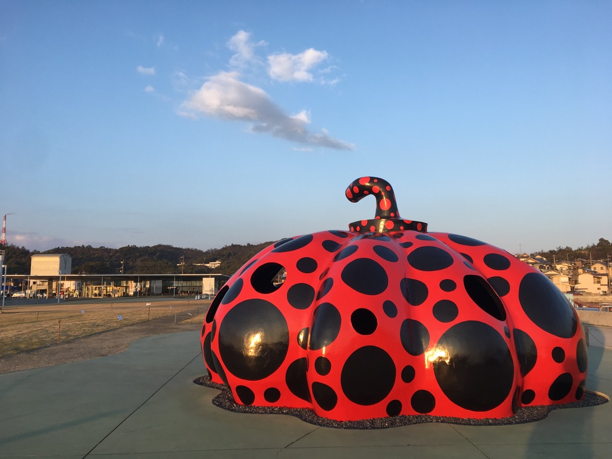
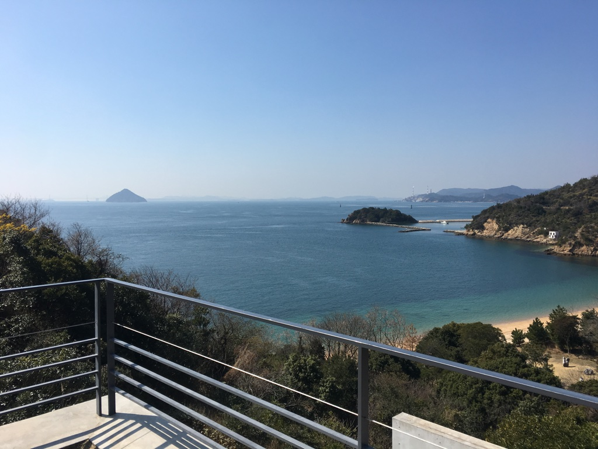
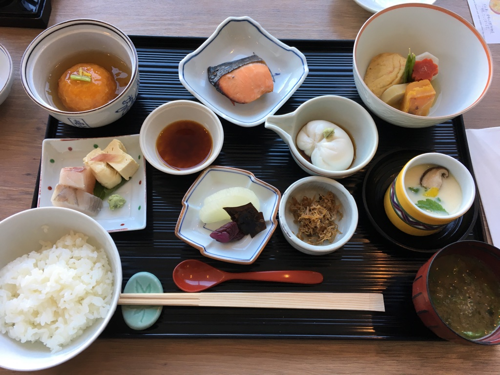

## 直島に行ってきた

春休みを利用して香川県の直島に行ってきました．
岡山からフェリーで瀬戸内海を渡り，島に着くとすぐ草間彌生の有名な「赤かぼちゃ」がありました．赤かぼちゃに限らず島内にはオブジェが点在しており，島内を巡っているだけでも面白かったです．コロナウイルスの影響もあり，残念ながら地中美術館や安藤忠雄ミュージアムは閉館していました．

宿は[ベネッセハウスミュージアム](http://benesse-artsite.jp/art/benessehouse-museum.html)というところに泊まったのですが，これは美術館とホテルが一体となった施設で，現代アート作品が展示されている建物の中に部屋がありました．

海の近くに位置していて，屋外に出ると波音がよく聞こえました．景色も開けていて，海が綺麗でした．
朝ごはんも美味しかったです．

また，[家プロジェクト](http://benesse-artsite.jp/art/arthouse.html)という，古民家をアーティストが修復し，作品として再生するというプロジェクトをツアーで見てまわったのですが，お寺や神社を題材にした興味深いものが多く，かなり面白かったです(写真とるの忘れた)．

