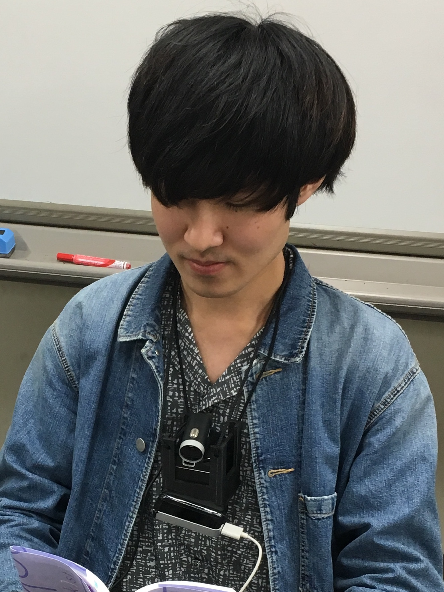

## About

岡 大貴(おか ひろき)

神戸大学大学院国際文化学研究科在学中．神戸大学工学部電気電子工学科卒業．プログラミングに関連したエンタテインメントの研究を行う．

## Research

* [本へのプロジェクションマッピングによる読書体験の拡張](https://drive.google.com/drive/folders/1arQthlk7_W19rMWrj95iYP-YIohr6bhF)
* [ゲーミフィケーションによるコードリーディングの促進](https://ipsj.ixsq.nii.ac.jp/ej/?action=pages_view_main&active_action=repository_view_main_item_detail&item_id=199459&item_no=1&page_id=13&block_id=8)