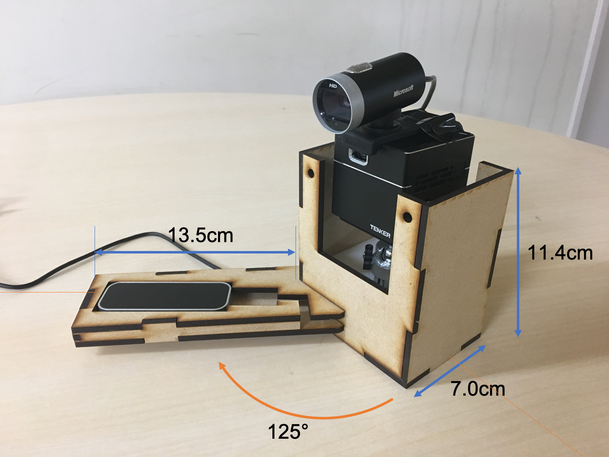

# Hiroki Oka

## About

岡 大貴

* 神戸大学工学部電気電子工学科 卒業(塚本寺田研),
* 神戸大学大学院国際文化学研究科博士課程前期課程(西田研)

## Research
* 本へのプロジェクションマッピングによる読書体験の拡張

論文：https://drive.google.com/drive/folders/1arQthlk7_W19rMWrj95iYP-YIohr6bhF

## Works
* [GitHub Typing](https://calm-chamber-39150.herokuapp.com/)

## Link

* [Twitter](https://twitter.com/hir0ki_0ka)
* [Instagram](http://instagram.com/hir0ki_0ka)
* [suzuri](http://suzuri.jp/hir0ki_0ka)
