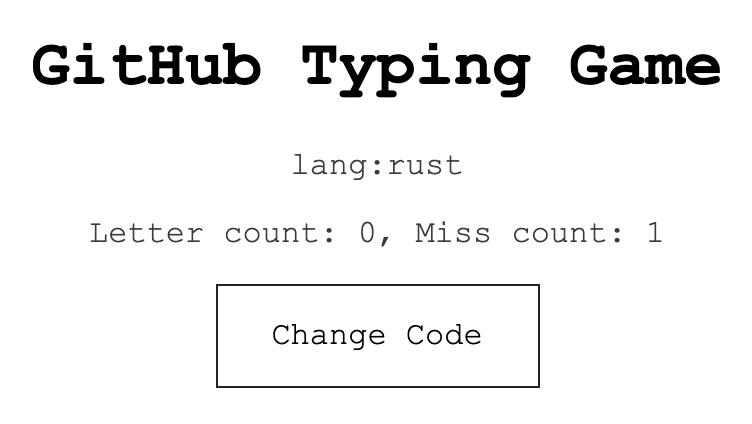
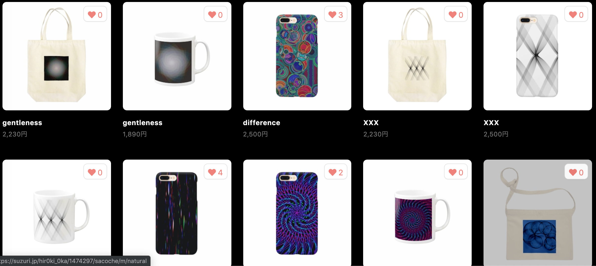
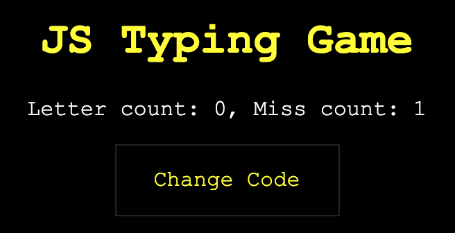

## Work

<!-- 
* [GitHub Typing](https://calm-chamber-39150.herokuapp.com/) -->

<!-- 
* [Generative Things](https://suzuri.jp/hir0ki_0ka) -->

<!-- /.row -->

  

    

      
      

        <h5 class="card-title">GitHub Typing</h5>
        
GitHubからランダムに選んだソースコードでタイピングをするゲーム

        
<a href="https://calm-chamber-39150.herokuapp.com/" class="btn btn-primary btn-sm">App</a>

      
<!-- /.card-body -->
    
<!-- /.card -->
  
<!-- /.col-sm-6.col-md-3 -->

  

    

      
      

        <h5 class="card-title">JS Typing</h5>
        
GitHub TypingのJavaScript版

        
<a href="https://js-typing.herokuapp.com/" class="btn btn-primary btn-sm">App</a>

      
<!-- /.card-body -->
    
<!-- /.card -->
  
<!-- /.col-sm-6.col-md-3 -->

  

    

      
      

        <h5 class="card-title">GitHub Entertainment App</h5>
        
GitHubのコードでクイズや占いをするアプリ

        
<a href="https://gh-app.herokuapp.com/" class="btn btn-primary btn-sm">App</a>

      
<!-- /.card-body -->
    
<!-- /.card -->
  
<!-- /.col-sm-6.col-md-3 -->

   

    

      
      

        <h5 class="card-title">Generative Things</h5>
        
p5.jsを使ったsketch集

        
<a href="https://neort.io/Gt8eI4ixzzfU5PAG1jp6vX7qJNx2" class="btn btn-primary btn-sm">neort</a>

      
<!-- /.card-body -->
    
<!-- /.card -->
  
<!-- /.col-sm-6.col-md-3 -->

<!-- /.row -->